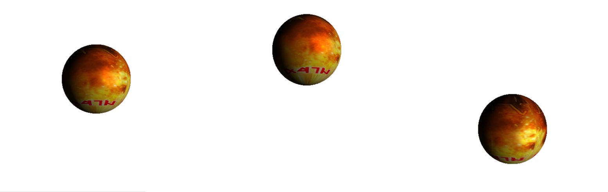
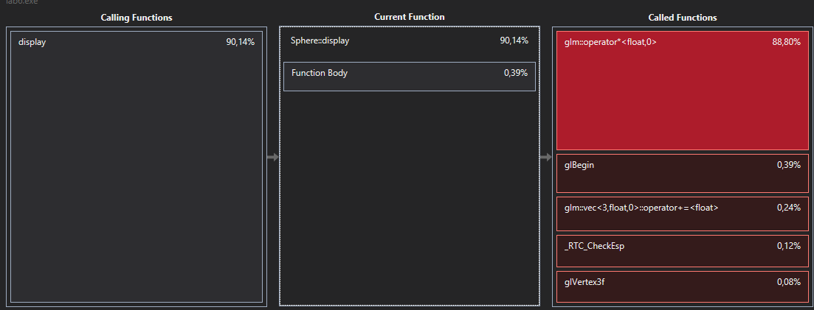

# 1. Условия задачи
* Изучение эффективных приемов организации приложений и оптимизации вызовов OpenGL
* Оптимизация приложения OpenGL, созданного в рамках предыдущей лабораторной работы, на основе выбора наиболее эффективных методик
* Обязательно использовать дисплейные списки и массивы вершин и еще 2 любые различные оптимизации(в сумме минимум 4 оптимизации)
* Результаты замеров оформить в табличном виде

# 2. Основная теория

## Дисплейные списки
Если мы несколько раз обращаемся к одной и той же группе команд, то их можно объединить в так называемый дисплейный список (display list), и вызывать его при необходимости. Для того, чтобы создать новый дисплейный список, надо поместить все команды, которые должны в него войти, между следующими операторными скобками:

```c++
void glNewList (GLuint list, GLenum mode)
...

void glEndList ()
```

Для различения списков используются целые положительные числа, задаваемые при создании списка значением параметра list, а параметрmodeопределяет режим обработки команд, входящих в список:

* **GL_COMPILE** - команды записываются в список без выполнения

* **GL_COMPILE_AND_EXECUTE** - команды сначала выполняются, а затем записываются в список

После того, как список создан, его можно вызвать командой

```c++
void glCallList (GLuint list)
```

указав в параметре listидентификатор нужного списка. Чтобы вызвать сразу несколько списков, можно воспользоваться командой

```c++
void glCallLists (GLsizei n, GLenum type, const GLvoid *lists)
```

вызывающей `n` списков с идентификаторами из массиваlists, тип элементов которого указывается в параметреtype. Это могут быть тип ы `GL_BYTE`, `GL_UNSIGNED_BYTE`, `GL_SHORT`, `L_INT`, `GL_UNSIGNED_INT` и некоторые другие. Для удаления списков используется команда

```c++
void glDeleteLists (GLint list, GLsizei range)
```

## Массивы вершин

Если вершин много, то чтобы не вызывать для каждой команду glVertex…(), удобно объединять вершины в массивы, используя команду

```c++
void glVertexPointer(GLint size, GLenum type, GLsizei stride, void *ptr)
```

которая определяет способ хранения и координаты вершин. При этом size определяет число координат вершины (может быть равен 2, 3, 4), type определяет тип данных (может быть равен `GL_SHORT`, `GL_INT`, `GL_FLOAT`, `GL_DOUBLE`). Иногда удобно хранить в одном массиве другие атрибуты вершины, и тогда параметр stride задает смещение от координат одной вершины до координат следующей; если stride равен нулю, это значит, что координаты расположены последовательно. В параметре ptr указывается адрес, где находятся данные.

Аналогично можно определить массив нормалей, цветов и некоторых других атрибутов вершины, используя команды

```c++
void NormalPointer(GLenum type, GLsizei stride, void*pointer)
void ColorPointer(GLintsize, GLenum type, GLsizei stride, void *pointer)
```

Для того, чтобы эти массивы можно было использовать в дальнейшем, надо вызвать команду
```c++
void glEnableClientState(GLenum array)
```

с параметрами `GL_VERTEX_ARRAY`, или `GL_NORMAL_ARRAY`, или `GL_COLOR_ARRAY` соответственно. После окончания работы с массивом желательно вызвать команду

```c++
void glDisableClientState(GLenum array)
```

с соответствующим значением параметра array.

Для отображения содержимого массивов используется команда

```c++
void glArrayElement(GLint index)
```

которая передает OpenGL атрибуты вершины, используя элементы массива с номером index. Это аналогично последовательному применению команд вида *glColor…(…)*, *glNormal…(…)*, *glVertex…(…)* c соответствующими параметрами. Однако вместо нее обычно вызывается команда

```c++
void glDrawArrays(GLenum mode, GLint first, GLsizei count)
```

рисующая `count` примитивов, определяемых параметром mode, используя элементы из массивов с индексами от `first` до `first+count-1`. Это эквивалентно вызову команды *glArrayElement()* с соответствующими индексами.

В случае если одна вершина входит в несколько примитивов, то вместо дублирования ее координат в массиве удобно использовать ее индекс.

Для этого надо вызвать команду

```c++
void glDrawArrays(GLenum mode, GLsizei count, GLenum type, void *indices)
```

где indices - это массив номеров вершин, которые надо использовать для построения примитивов, `type` определяет тип элементов этого массива: `GL_UNSIGNED_BYTE`, `GL_UNSIGNED_SHORT`, `GL_UNSIGNED_INT`, а `count` задает их количество.

# 3. Реализация
В прошлой лабораторной работе была реализована анимированная сфера с текстурированием и освещением.



## Измерение эффективности

Создадим класс **TimeCounter**, отвечабщий за измерение времени выполнения

Для начала определим функцию текущего времени в миллисекундах

```c++
int get_milli_count() {
	timeb tb;
	ftime(&tb);
	int nCount = tb.millitm + (tb.time & 0xfffff) * 1000;
	return nCount;
}
```
Теперь переёдйм к классу **TimeCounter**:

```c++
class TimeCounter {
private:
    // Количество обработанных кадров
	int frames = 0;
    // Суммарное время кадров в миллисекундах
	int ms_sum = 0;
	// Временная метка
	int time_marked = 0;
    // Лимит кадров (нужен, чтобы понять, когда остановить программу)
	int frame_limit = 1000;
public:
    // Начать отсчёт времени кадра
	void start_frame() {
        time_marked = get_milli_count();
    }
    // Закончить  отсчёт времени кадра
	void end_frame() {
        auto frame = get_milli_count() - time_marked;
        ms_sum += frame;
        frames++;
    }
    // Геттеры
	int get_frames() {
        return frames;
    }
	int get_ms_sum() {
        return ms_sum;
    }
    // Среднее время обработки кадров
	double get_average_time() {
        return ms_sum * 1.0 / frames;
    }
    // Проверка на превышение лимита кадров
	bool check_frame_limit() {
        return frames >= frame_limit;
    }
};
```

### Использование
```c++
// Инициализируем TimeCounter
TimeCounter time_counter;
...

// glutDisplayFunc
void display(void) {
    // Начинаем отсчёт
    time_counter.start_frame();
    ... // Выполняем действие, навыполнение которого хотим засечь время
    // Заканчиваем отсчёт
    time_counter.end_frame();

    ...

    // При достижении лимита кадров выводим статистику и закрываем окно
    if (time_counter.check_frame_limit()) {
		std::cout << "Frames processed:   " << time_counter.get_frames() << "\n";
		std::cout << "Total time spent:   " << time_counter.get_ms_sum() << "\n";
		std::cout << "Average frame time: " << time_counter.get_average_time() << " ms\n";
		glutDestroyWindow(window);
	}
```

Теперь перейдём непосредственно к оптимизациям:

## I. Отсечение
Заметим, что сфера представлена как набор граней, причём идёт отрисовка всех граней: и видимых, и невидимых с точки зрения камеры.
```c++
// Создаём матрицу поворота вокруг оси Z
auto rot_mat = rotate_z(angle);
// Пробегаем по массиву с сгенерированными вершинами
for (auto vert : vertices) { 
    // Анимация вращения
    vert.pos = rot_mat * vert.pos;
    vert.norm = rot_mat * vert.norm;
    // Ставим в соответствие точку текстуры
    glTexCoord2f(vert.tex.x, vert.tex.y);
    // Применяем смещение
    auto pos_cur = vert.pos;
    pos_cur.z *= -1 * stretching;
    pos_cur += pos;
    // Обозначаем координату и нормаль
    glVertex3f(pos_cur.x, pos_cur.y, pos_cur.z);
    glNormal3f(vert.norm.x, vert.norm.y, -vert.norm.z);
}
```
Можно модифицировать этот код, добавив отсечение невидимых граней. Так как мы камера статична и направлена вдоль оси Y, просто отбросим все вершины с координатой Y больше 0.
```c++
for (auto vert : vertices) { 
    // Анимация вращения
    vert.pos = rot_mat * vert.pos;
    vert.norm = rot_mat * vert.norm;
    // Отсечение
    if (ENABLE_CLIPPING && vert.pos.y > 0)
			continue;
    ...
}
```
Теперь замерим и сравним результаты:
### Без отсечения
Номер запуска  | Суммарное время, мс   | Кадров | Седнее время на кадр, мс
---------------|-----------------------|--------|---------------------
1              | 13353                 | 1000   | 13.353
2              | 12929                 | 1000   | 12.929
3              | 12456                 | 1000   | 12.456
4              | 12500                 | 1000   | 12.5

Итого: среднее время обработки кадра `12.8095` мс

### С отсечением
Номер запуска  | Суммарное время, мс   | Кадров | Седнее время на кадр, мс
---------------|-----------------------|--------|---------------------
1              | 12135                 | 1000   | 12.135
2              | 11891                 | 1000   | 11.891
3              | 11899                 | 1000   | 11.899
4              | 12032                 | 1000   | 12.032

Итого: среднее время обработки кадра `11.9892` мс

>Как можно видеть, с оптимизацией время обработки кадра уменьшилось на `0.820` мс, `6.4%` от изначального времени

## II. Использование glRotatef
Прежде мы поворачивали каждую вершину отдельно, используя умножение на матрицу поворота

Так задана функция для составления матрицы поворота:
```c++
glm::mat3x3 rotate_z(double angle) {
	return {
		cos(angle), -sin(angle), 0,
		sin(angle), cos(angle),  0,
		0,          0,           1
	};
}
```

И так мы применяем её в цикле:
```c++
for (auto vert : vertices) { 
    // Анимация вращения
    vert.pos = rot_mat * vert.pos;
    vert.norm = rot_mat * vert.norm;
    ...
}
```

Уберём анимацию вращения из цикла, а перед циклом применим функцию glRotatef
```c++
if (ENABLE_MATRIX_ROTATION)
	glRotatef(-angle * 180 / PI, 0, 1, 0);
```

Выключим оптимизацию отсечения и замерим результат

### Использование glRotatef
Номер запуска  | Суммарное время, мс   | Кадров | Седнее время на кадр, мс
---------------|-----------------------|--------|---------------------
1              | 1317                  | 1000   | 1.317
2              | 1446                  | 1000   | 1.446
3              | 1332                  | 1000   | 1.332
4              | 1391                  | 1000   | 1.391

Итого: среднее время обработки кадра `1.3715` мс

>Это на `11.438` мс быстрее изначального времени, что есть `89.3%` от него


## Теперь попробуем включить обе оптимизации и сравнить время работы

Так как теперь мы осуществляем поворот с помощью glRotatef, нам надо усовершенствовать отсечение:
```c++
if (ENABLE_CLIPPING &&
    // В случае, если оптимизация поворота отключена:
    (!ENABLE_MATRIX_ROTATION && vert.pos.y > 0 ||
    // В случае, если оптимизация поворота включена:
    ENABLE_MATRIX_ROTATION && (rot_mat * vert.pos).y > 0))
    continue;
```

### Использование glRotatef и отсечения
Номер запуска  | Суммарное время, мс   | Кадров | Седнее время на кадр, мс
---------------|-----------------------|--------|---------------------
1              | 6518                  | 1000   | 6.518
2              | 6510                  | 1000   | 6.510
3              | 6548                  | 1000   | 6.548
4              | 6553                  | 1000   | 6.553

Итого: среднее время обработки кадра `6.5323` мс

> Это на `6.2772` мс быстрее, чем без оптимизаций, но `5.1608` мс медленнее, чем только с оптимизацией поворота

Как мы видим, с 2мя включенными оптимизациями программа работает хуже, чем только с оптимизацией поворота. Разберёмся, почему.

Воспользуеся инструментом Performance Profiler в Microsoft Visual Studio



Как мы видим, большую часть времени занимает оператор перемножения матриц библиотеки *glm*. Создадим свою структуру для поворотов вокруг оси Z
```c++
struct RotateZ {
    // Сохранённые значения синуса и косинуса, чтобы не считать каждый раз заново
	double sin_a;
	double cos_a;

    // Конструктор по углу
	RotateZ(double angle) {
		sin_a = sin(angle);
		cos_a = cos(angle);
	}

    // Конструктор по синусу и косинусу
	RotateZ(double sin_a, double cos_a) : sin_a(sin_a), cos_a(cos_a) {};

    // Создаёт инверсию поворота, которая будет поворачивать на угол -angle
	RotateZ invert() {
		return RotateZ(-sin_a, cos_a);
	}

    // Непосредственно применение поворота вокруг оси Z к вектору
	glm::vec3 operator()(const glm::vec3& pos) {
		return {
			pos.x * cos_a - pos.y * sin_a,
			pos.x * sin_a + pos.y * cos_a,
			pos.z
		};
	}
};
```

Теперь заменим этой стуктурой использование *glm::mat3x3*
```c++
// Создаём структуру поворота
RotateZ rotation(angle);

for (auto vert : vertices) {
    // Применяем поворот, если оптимизация поворота отключена
    if (!ENABLE_MATRIX_ROTATION) {
        vert.pos = rotation(vert.pos);
        vert.norm = rotation(vert.norm);
    }
    // Отсечение
    if (ENABLE_CLIPPING &&
        // В случае, если оптимизация поворота отключена:
        (!ENABLE_MATRIX_ROTATION && vert.pos.y > 0 ||
        // В случае, если оптимизация поворота включена:
        ENABLE_MATRIX_ROTATION && (rotation.invert()(vert.pos)).y > 0))
        continue;
    ...
}
```

А теперь посмотрим, как это влияет на время работы. Сравним среднее время обработки кадра с использованием *glm::mat3x3* и *RotateZ*, посчитаем их разность
Оптимизации           | glm::mat3x3           | RotateZ | Разница (мс) | Разница (%)
----------------------|-----------------------|-------- |--------------|------------
Нет                   | 12.8095               | 2.2808  | 10.5287      | 82.2
Отсечение             | 11.9892               | 1.7035  | 10.2857      | 85.8
glRotatef             | 1.3715                | 1.2395  | 0.132        | 9.62
Отсечение + glRotatef | 6.5323                | 1.7043  | 4.828        | 73.90

Как мы видим, для всех случаев произошло улучшение производительности, однако всё равно отсечение проигрывает слишком затратно по сравнению с использованием glRotatef

## III. Дисплейные списки
Дисплейный список - набор команд OpenGL, которые компилируются и далее могут быть вызваны. Обернём создание сферы и наложение текстуры в такой список:
```c++
// Создаём дисплейный список, ему присваивается индекс
list_index = glGenLists(1);

// Начинаем список, внутри объявляем создание сферы
glNewList(list_index, GL_COMPILE);
    glTexParameteri(GL_TEXTURE_2D, GL_TEXTURE_MAG_FILTER, GL_LINEAR);
    glRotatef(-90, 1, 0, 0);
    glBindTexture(GL_TEXTURE_2D, texture);
    glBegin(GL_TRIANGLE_STRIP);
    for (auto vert : vertices) {
        glTexCoord2f(vert.tex.x, vert.tex.y);
        auto pos_cur = vert.pos;
        pos_cur.z *= -1 * stretching;
        pos_cur += pos;
        glVertex3f(pos_cur.x, pos_cur.y, pos_cur.z);
        glNormal3f(vert.norm.x, vert.norm.y, -vert.norm.z);
    }
    glEnd();
glEndList();
```

Теперь функция отрисовки сферы выглядит следующим образом:
```c++
// Смещение сферы
glTranslated(0, pos.z, 0);
// Поворот сферы
glRotatef(-angle * 180 / PI, 0, 1, 0); 
// Выполнение дисплейного списка
glCallList(list_index);
```

Теперь измерим время работы

### Использование дисплей-листа
Номер запуска  | Суммарное время, мс   | Кадров | Седнее время на кадр, мс
---------------|-----------------------|--------|---------------------
1              | 592                   | 1000   | 0.592
2              | 627                   | 1000   | 0.627
3              | 585                   | 1000   | 0.585
4              | 578                   | 1000   | 0.578

Итого: среднее время обработки кадра `0.596` мс
>Заметим, что в случае с дисплей-листами, мы не можем применить предыдущую оптимизацию с отсечением, так как в дисплей-лист можно обёртывать только команды OpenGL. Впрочем, получившийся результат и так превосходит любой из предыдущих

## IV. Массивы вершин
Вместо того, чтобы каждый раз вызывать в цикле *glTexCoord2f(...)*, *glVertex3f(...)* и *glNormal3f(...)*, можно объеденить информацию о вершинах в буфер.

При инициализации сферы создадим буферы вершин, нормалей и текстурных координат
```c++
// Создание буферов вершин, нормалей и текстурных координат
float* coords = new float[vertices.size() * 3];
float* norms = new float[vertices.size() * 3];
float* tex_coords = new float[vertices.size() * 2];

// Заполнение данными из vertices
for (int i = 0; i < vertices.size(); i++) {
    coords[i * 3 + 0] = vertices[i].pos.x;
    coords[i * 3 + 1] = vertices[i].pos.y;
    coords[i * 3 + 2] = vertices[i].pos.z;

    norms[i * 3 + 0] = vertices[i].norm.x;
    norms[i * 3 + 1] = vertices[i].norm.y;
    norms[i * 3 + 2] = vertices[i].norm.z;

    tex_coords[i * 2 + 0] = vertices[i].tex.x;
    tex_coords[i * 2 + 1] = -vertices[i].tex.y;
}

// Передача буферов в OpenGL
glVertexPointer(3, GL_FLOAT, 0, coords);
glNormalPointer(GL_FLOAT, 0, norms);
glTexCoordPointer(2, GL_FLOAT, 0, tex_coords);

// Активация
glEnableClientState(GL_VERTEX_ARRAY);
glEnableClientState(GL_NORMAL_ARRAY);
glEnableClientState(GL_TEXTURE_COORD_ARRAY);
```

Теперь отрисовка осущесвляется так:
```c++
// Смещение сферы
glTranslated(0, pos.z, 0);
// Поворот сферы
glRotatef(-angle * 180 / PI, 0, 1, 0);

// Задание параметров
glTexParameteri(GL_TEXTURE_2D, GL_TEXTURE_MAG_FILTER, GL_LINEAR);
glRotatef(-90, 1, 0, 0);

// Отрисовка массивов
glDrawArrays(GL_TRIANGLE_STRIP, 0, vertices.size());
```

Теперь измерим время работы

### Использование массивов вершин
Номер запуска  | Суммарное время, мс   | Кадров | Седнее время на кадр, мс
---------------|-----------------------|--------|---------------------
1              | 589                   | 1000   | 0.589
2              | 621                   | 1000   | 0.621
3              | 572                   | 1000   | 0.572
4              | 590                   | 1000   | 0.590

Итого: среднее время обработки кадра `0.593` мс

>Как мы видим результат практически неотличим от результата оптимизации дисплей-листом

## V. Массивы вершин + дисплей-лист
Попробуем объеденить последние 2 метода оптимизации. У нас есть 3 команды, которые не зависят от параметров и которые можно поместить в дисплей-лист:
```c++
glTexParameteri(GL_TEXTURE_2D, GL_TEXTURE_MAG_FILTER, GL_LINEAR);
glRotatef(-90, 1, 0, 0);
glDrawArrays(GL_TRIANGLE_STRIP, 0, vertices.size());
```
### Массивы вершин + дисплей-лист 
Номер запуска  | Суммарное время, мс   | Кадров | Седнее время на кадр, мс
---------------|-----------------------|--------|---------------------
1              | 590                   | 1000   | 0.590
2              | 543                   | 1000   | 0.543
3              | 549                   | 1000   | 0.549
4              | 577                   | 1000   | 0.577

Итого: среднее время обработки кадра `0.565` мс

>Не смотря на то, что в дисплей-лист было объеденено только 3 команды, небольшая разница с предыдущими 2мя оптимизациями наблюдается

## Итоги
Теперь, когда мы применили все возможные оптимизации, сравним их в одной таблице, упорядочив по возрастанию времени

Оптимизации                         | Время обработки кадра, мс          
------------------------------------|-----------------------
Массивы вершин + дисплей-лист       | 0.565
Массивы вершин                      | 0.593
Дисплей-лист                        | 0.596
glRotatef  (RotateZ)                | 1.2395  
glRotatef  (glm::mat3x3)            | 1.3715 
Отсечение (RotateZ)                 | 1.7035  
Отсечение + glRotatef (RotateZ)     | 1.7043
Нет (RotateZ)                       | 2.2808 
Отсечение + glRotatef (glm::mat3x3) | 6.5323   
Отсечение (glm::mat3x3)             | 11.9892  
Нет (glm::mat3x3)                   | 12.8095      

# 4. Заключение
В работе были применены различные оптимизации отрисовки. Было проведено сравнение, в ходе которого стало ясно, какие оптимизации дают лучший результат. Как мы видим из таблицы, оптимизации встроенными средствами OpenGL оказались каиболее эффективными